# IntelliFlow Enterprise-AI-Orchestration-System
# 🤖 Enterprise IT Support & Research Chatbot

A comprehensive AI-powered enterprise chatbot system that combines **IT support automation**, **database operations**, and **advanced research capabilities** using multi-hop graph reasoning. The system features intelligent intent classification, MCP (Model Context Protocol) server integration, and a powerful RAG (Retrieval-Augmented Generation) system for research queries.

## 🏗️ System Architecture

```mermaid
graph TB
    UI[🖥️ Streamlit UI] --> WORKFLOW[🎯 Complete Chatbot Workflow]
    WORKFLOW --> CLAUDE_INTENT[🧠 Claude Intent Classifier]
    
    CLAUDE_INTENT --> INCIDENT[🚨 System Incident]
    CLAUDE_INTENT --> DATA[🔍 Data Query]
    CLAUDE_INTENT --> INFO[📚 Information Request]
    CLAUDE_INTENT --> RESEARCH[📊 Research Query]
    
    INCIDENT --> SN_MCP[🎫 ServiceNow MCP Server]
    DATA --> DB_MCP[🗄️ Database MCP Server]
    RESEARCH --> RESEARCH_MCP[🔬 Research MCP Server]
    
    RESEARCH_MCP --> NEO4J[🕸️ Neo4j Knowledge Graph]
    NEO4J --> RAG_SYSTEM[🧠 Multi-Hop RAG System]
```



## 🏗️ Data Flow

```mermaid
graph TB
    %% User Interface Layer
    UI[🖥️ Streamlit UI<br/>Enterprise IT Support & Research Chatbot]
    
    %% Core Orchestration
    UI --> WORKFLOW[🎯 Complete Chatbot Workflow<br/>Intent Classification + MCP Integration]
    
    %% Intent Classification
    WORKFLOW --> CLAUDE_INTENT[🧠 Claude Intent Classifier<br/>Haiku-3 Model]
    CLAUDE_INTENT --> INTENT_TYPES{Intent Classification}
    
    %% Intent Types
    INTENT_TYPES -->|System Down/Broken| INCIDENT[🚨 System Incident]
    INTENT_TYPES -->|Missing Data/Updates| DATA[🔍 Data Query]
    INTENT_TYPES -->|How-to/Documentation| INFO[📚 Information Request]
    INTENT_TYPES -->|Research/Papers/Analysis| RESEARCH[📊 Research Query]
    
    %% System Incident Workflow
    INCIDENT --> INCIDENT_ANALYSIS[🔧 Claude Incident Analysis<br/>• Severity Assessment<br/>• Impact Analysis<br/>• Assignment Group]
    INCIDENT_ANALYSIS --> SN_INCIDENT[🎫 ServiceNow MCP Server<br/>Port 8082<br/>create_incident_ticket]
    SN_INCIDENT --> INCIDENT_RESULT[✅ Critical Ticket Created<br/>• Ticket Number<br/>• Priority Assignment<br/>• SLA Response Time]
    
    %% Data Query Workflow
    DATA --> DATA_DETECTION[🤖 Claude Data Analysis<br/>Manipulation vs Search Detection]
    DATA_DETECTION --> DATA_CHOICE{Operation Type}
    
    %% Data Manipulation Path
    DATA_CHOICE -->|UPDATE/DELETE/INSERT| APPROVAL[🔒 Approval Required]
    APPROVAL --> SN_REQUEST[🎫 ServiceNow MCP Server<br/>create_service_request<br/>Data Admin Team]
    SN_REQUEST --> APPROVAL_RESULT[⏳ Approval Pending<br/>• Admin Notification<br/>• 24-48hr Timeline]
    
    %% Data Search Path
    DATA_CHOICE -->|SEARCH/FIND| DB_SEARCH[🗄️ Database MCP Server<br/>Port 8083<br/>search_database]
    DB_SEARCH --> SEARCH_CHOICE{Results Found?}
    
    SEARCH_CHOICE -->|Found| SEARCH_SUCCESS[✅ Data Retrieved<br/>• Results Preview<br/>• Record Details]
    SEARCH_CHOICE -->|Missing Data| MISSING_DETECTED{Missing Data Query?}
    
    MISSING_DETECTED -->|Yes| INVESTIGATION[🎫 Create Investigation Ticket<br/>Brazil Claims Team]
    MISSING_DETECTED -->|No| NO_RESULTS[ℹ️ No Results<br/>Search Suggestions]
    
    %% Research Query Workflow - Your New Addition!
    RESEARCH --> RAG_SEARCH[🔬 Research MCP Server<br/>Port 8084<br/>Direct HTTP Calls]
    RAG_SEARCH --> NEO4J[🕸️ Neo4j Knowledge Graph<br/>Multi-Hop Reasoning]
    
    %% RAG System Components
    NEO4J --> ENTITY_EXTRACT[📋 Claude Entity Extraction<br/>Research Paper Context]
    ENTITY_EXTRACT --> PATH_DISCOVERY[🕸️ Multi-Hop Path Discovery<br/>1-3 Hops, 20 Paths/Entity]
    PATH_DISCOVERY --> SEMANTIC_RANK[📊 Semantic Ranking<br/>SentenceTransformer<br/>Cosine Similarity]
    SEMANTIC_RANK --> CONTEXT_ASSEMBLY[🔗 Context Assembly<br/>50 Knowledge Triples]
    CONTEXT_ASSEMBLY --> ANSWER_GEN[🧠 Claude Answer Generation<br/>Multi-Hop Reasoning Context]
    ANSWER_GEN --> RESEARCH_RESULT[📊 Comprehensive Research Answer<br/>• Entities Found<br/>• Reasoning Paths<br/>• Knowledge Connections]
    
    %% Information Request Workflow
    INFO --> KNOWLEDGE_BASE[📚 Knowledge Base Lookup<br/>Static Documentation]
    KNOWLEDGE_BASE --> INFO_RESULT[📖 Documentation Provided<br/>• Process Guides<br/>• Technical Details]
    
    %% MCP Server Architecture
    subgraph MCP_SERVERS[🏗️ MCP Server Architecture]
        SN_MCP[🎫 ServiceNow MCP<br/>Port 8082<br/>• Incident Management<br/>• Service Requests<br/>• Approval Workflows]
        
        DB_MCP[🗄️ Database MCP<br/>Port 8083<br/>• Claim Verification<br/>• Engine Updates<br/>• Data Searches]
        
        RESEARCH_MCP[🔬 Research MCP<br/>Port 8084<br/>• Paper Search<br/>• Topic Analysis<br/>• Concept Relations]
    end
    
    %% External Systems
    subgraph EXTERNAL[🌐 External Systems]
        SERVICENOW[(🎫 ServiceNow<br/>Enterprise ITSM)]
        DATABASE[(🗄️ Enterprise Database<br/>Claims, Engines, Warranty)]
        NEO4J_DB[(🕸️ Neo4j Database<br/>Research Knowledge Graph)]
    end
    
    %% Connections to External Systems
    SN_MCP -.-> SERVICENOW
    DB_MCP -.-> DATABASE
    RESEARCH_MCP -.-> NEO4J_DB
    
    %% Use Case Examples
    subgraph EXAMPLES[📋 Use Case Examples]
        UC1[1️⃣ 'Brazil claim 1-ABCD missing'<br/>→ DATA_QUERY → DB_SEARCH → INVESTIGATION]
        UC2[2️⃣ 'Warranty system not working'<br/>→ INCIDENT → SEVERITY_ANALYSIS → CRITICAL_TICKET]
        UC3[3️⃣ 'Update engine X10 to X15'<br/>→ DATA_QUERY → MANIPULATION → APPROVAL_REQUEST]
        UC4[4️⃣ 'What are transformers?'<br/>→ RESEARCH → RAG_ANALYSIS → COMPREHENSIVE_ANSWER]
    end
    
    %% Styling
    classDef uiStyle fill:#e1f5fe,stroke:#01579b,stroke-width:2px
    classDef workflowStyle fill:#f3e5f5,stroke:#4a148c,stroke-width:2px
    classDef mcpStyle fill:#e8f5e8,stroke:#1b5e20,stroke-width:2px
    classDef externalStyle fill:#fff3e0,stroke:#e65100,stroke-width:2px
    classDef ragStyle fill:#fce4ec,stroke:#880e4f,stroke-width:2px
    
    class UI uiStyle
    class WORKFLOW,CLAUDE_INTENT workflowStyle
    class SN_MCP,DB_MCP,RESEARCH_MCP mcpStyle
    class SERVICENOW,DATABASE,NEO4J_DB externalStyle
    class NEO4J,ENTITY_EXTRACT,PATH_DISCOVERY,SEMANTIC_RANK,CONTEXT_ASSEMBLY,ANSWER_GEN ragStyle
```


## 🚀 Key Features

### 💡 Intent Classification & Routing
- **Claude-powered intent classification** with 4 main categories:
  - 🚨 **System Incidents** → ServiceNow ticket creation
  - 🔍 **Data Queries** → Database operations with approval workflows
  - 📚 **Information Requests** → Knowledge base lookup
  - 📊 **Research Queries** → Advanced graph-based reasoning

### 🎫 ServiceNow Integration
- **Automated ticket creation** for system incidents
- **Service request management** for data operations
- **Priority-based SLA assignment**
- **Real-time status tracking**

### 🗄️ Intelligent Database Operations
- **Text-to-SQL conversion** using Claude
- **Smart approval workflows** for sensitive data modifications
- **Missing data investigation** with automatic ticket creation
- **Multi-table search capabilities**

### 🔬 Advanced Research System
- **Document analysis** with LLM-powered triple extraction
- **2-pass extraction strategy** for comprehensive knowledge capture
- **Named Entity Recognition (NER)** and relationship mapping
- **Neo4j knowledge graph** construction
- **Multi-hop path reasoning** for complex queries
- **Semantic similarity ranking** for relevant results

## 📁 Project Structure

```
enterprise-chatbot/
├── 🎯 Core Workflow
│   ├── complete_chatbot_workflow.py    # Main orchestration logic
│   ├── intent_classifier.py            # Claude-powered intent classification
│   └── enhanced_streamlit_chatbot.py   # Multi-MCP client
│
├── 🖥️ User Interface
│   ├── fixed_streamlit_app.py          # Main Streamlit application
│   └── paste.txt                       # System architecture diagram
│
├── 🏗️ MCP Servers
│   ├── servicenow_mcp_server.py        # ServiceNow ticket management
│   ├── database_mcp_server.py          # Database operations & text-to-SQL
│   └── research_mcp_server.py          # Research paper analysis
│
├── 🔬 Research & Knowledge Graph
│   ├── enhanced_rag_system.py          # Multi-hop RAG implementation
│   ├── BuildKnowledgeGraph_Neo4j.py    # Knowledge graph construction
│   └── Triples.ipynb                   # Document analysis & triple extraction
│
└── 🚀 Deployment
    └── startupscript.py                # Automated server startup
```

## 🛠️ Installation & Setup

### Prerequisites
```bash
# Python 3.8+
pip install streamlit anthropic pandas neo4j
pip install sentence-transformers fastapi uvicorn
pip install mcp fastmcp PyPDF2 langchain
pip install sqlite3 aiohttp requests tqdm nltk
```

### Environment Setup
1. **Claude API Key**: Add your Anthropic Claude API key
2. **Neo4j Database**: Set up Neo4j instance (bolt://localhost:7687)
3. **MCP Servers**: Configure server ports (8082, 8083, 8084)

### Quick Start
```bash
# 1. Start all MCP servers
python startupscript.py

# 2. Launch Streamlit interface (in new terminal)
streamlit run fixed_streamlit_app.py

# 3. Access the application
# Open browser to: http://localhost:8501
```

## 🔬 Research System Deep Dive

### Document Analysis Pipeline
The system processes research papers through a sophisticated multi-stage pipeline:

#### 1. 📄 Document Processing
- **PDF text extraction** using PyPDF2
- **Intelligent chunking** with RecursiveCharacterTextSplitter
- **Overlap management** for context preservation

#### 2. 🧠 LLM-Powered Triple Extraction (2-Pass Strategy)

**Pass 1: Primary Extraction**
```python
# Comprehensive entity extraction including:
- Authors and researchers
- Methodologies and techniques  
- Algorithms and models
- Performance metrics
- Experimental results
- Technical concepts
```

**Pass 2: Verification & Enhancement**
```python
# Verification pass identifies missed relationships:
- Author-contribution relationships
- Method-performance relationships
- Comparison relationships
- Temporal and causal relationships
- Implementation relationships
```

#### 3. 🕸️ Knowledge Graph Construction
- **Entity standardization** using NLP techniques
- **Relationship deduplication** and normalization
- **Neo4j graph database** population
- **Triple validation** and quality control

### Multi-Hop Graph Reasoning

#### 🔍 Entity-Centric Path Discovery
```python
# Multi-hop path discovery (1-3 hops)
MATCH path = (start:Entity)-[*1..3]-(end:Entity)
WHERE start.name = $entity
RETURN path, relationships(path), nodes(path)
```

#### 📊 Semantic Ranking System
- **SentenceTransformer embeddings** for semantic similarity
- **Path relevance scoring** with length penalties
- **Context assembly** from top-ranked paths

#### 🎯 Answer Generation
- **Claude-powered reasoning** using assembled context
- **Multi-hop relationship explanation**
- **Confidence scoring** based on evidence strength

## 🖥️ API Endpoints & Services

### ServiceNow MCP Server (Port 8082)
```bash
# Ticket Management
POST /tools/call
  - create_incident_ticket
  - create_service_request
  - get_ticket_status

# Monitoring
GET /tickets          # All tickets
GET /health          # Health check
GET /                # Dashboard
```

### Database MCP Server (Port 8083)
```bash
# Database Operations
POST /tools/call
  - search_database           # Text-to-SQL conversion
  - update_engine_attribute   # With approval workflow
  - verify_claim_exists       # Claim verification

# Data Access
GET /data/{table}    # Table data
GET /schema          # Database schema
GET /approvals       # Pending approvals
```

### Research MCP Server (Port 8084)
```bash
# Research Operations
POST /tools/call
  - search_research_papers    # Multi-hop reasoning
  - analyze_research_topic    # Topic analysis
  - find_paper_relationships  # Concept relationships

# Testing & Monitoring
GET /test/simple-query      # RAG system test
GET /health                 # System status
```

## 🎯 Usage Examples

### 1. 🚨 System Incident Handling
```
User: "The downstream integration to Warranty system is not working"

System Flow:
1. Intent Classification → SYSTEM_INCIDENT
2. Claude Analysis → Severity: HIGH, System: WARRANTY
3. ServiceNow Ticket → INC000123 created
4. Response → Ticket details + SLA timeline
```

### 2. 🔍 Data Query with Approval
```
User: "Update engine serial 12345678 model from X10 to X15"

System Flow:
1. Intent Classification → DATA_QUERY
2. LLM Analysis → UPDATE operation detected
3. Approval Required → REQ000456 created
4. Response → Approval pending notification
```

### 3. 📊 Research Query
```
User: "What are transformer models in machine learning?"

System Flow:
1. Intent Classification → RESEARCH_QUERY
2. Entity Extraction → ["transformer", "machine learning"]
3. Multi-hop Reasoning → Graph path discovery
4. Answer Generation → Comprehensive explanation with citations
```

### 4. 🔍 Missing Data Investigation
```
User: "I am missing Brazil claim number '1-ABCD'"

System Flow:
1. Intent Classification → DATA_QUERY
2. Database Search → Claim not found
3. Investigation Ticket → Assigned to Brazil Claims Team
4. Response → Investigation initiated notification
```

## 🏢 Enterprise Features

### 🔒 Security & Compliance
- **Approval workflows** for sensitive data operations
- **Audit trails** for all system interactions
- **Role-based access** control integration
- **Data privacy** protection mechanisms

### 📈 Monitoring & Analytics
- **Real-time dashboards** for system health
- **Performance metrics** tracking
- **Error logging** and alerting
- **Usage analytics** and reporting

### 🔄 Scalability & Integration
- **Microservices architecture** with MCP servers
- **Horizontal scaling** capabilities
- **API-first design** for easy integration
- **Extensible plugin** system

## 🧪 Testing & Development

### Test Scenarios
```bash
# Test intent classification
python intent_classifier.py

# Test complete workflow
python complete_chatbot_workflow.py

# Test individual MCP servers
python servicenow_mcp_server.py --port 8082
python database_mcp_server.py --port 8083
python research_mcp_server.py --port 8084

# Test research system
python enhanced_rag_system.py
```

### Development Mode
```bash
# Start servers with reload
uvicorn servicenow_mcp_server:app --reload --port 8082
uvicorn database_mcp_server:app --reload --port 8083
uvicorn research_mcp_server:app --reload --port 8084
```

## 📊 Performance Metrics

### Research System Performance
- **Triple Extraction**: ~21.6 triples per chunk average
- **Entity Recognition**: 95%+ accuracy for technical terms
- **Graph Coverage**: 94.3% content coverage
- **Response Time**: <30 seconds for complex queries

### System Integration
- **Intent Classification**: 85%+ accuracy across categories
- **Ticket Creation**: 100% success rate
- **Database Operations**: Sub-second query response
- **Multi-hop Reasoning**: 1-3 hop path discovery

## 🔧 Configuration

### Core Settings
```python
# Claude API Configuration
CLAUDE_API_KEY = "your-api-key"
CLAUDE_MODEL = "claude-3-haiku-20240307"

# Neo4j Configuration  
NEO4J_URI = "bolt://localhost:7687"
NEO4J_USER = "neo4j"
NEO4J_PASSWORD = "your-password"

# Server Ports
SERVICENOW_PORT = 8082
DATABASE_PORT = 8083
RESEARCH_PORT = 8084
```

### Reasoning Parameters
```python
# Multi-hop Reasoning
MAX_HOPS = 3
MAX_PATHS_PER_ENTITY = 20
MAX_CONTEXT_TRIPLES = 50
MIN_PATH_SIMILARITY = 0.3
```


**Built with ❤️ for Enterprise IT Teams**

*Empowering organizations with intelligent automation, advanced research capabilities, and seamless workflow integration.*
